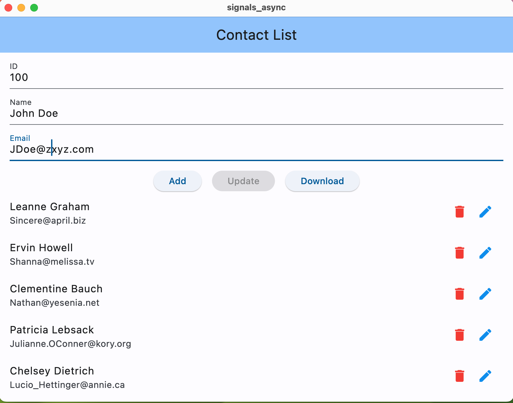

# signals_async_watch

This implementation is with Signals Watch().

We are going to use the signals library to make simple demonstration of how to use the async package to make asynchronous calls in Dart.

In this example we will be dealing with **futures**. In another article we will be dealing with streams.

We will work with a list of contacts. We will use the typicode API to get the list of contacts. [Typicode](https://jsonplaceholder.typicode.com/users)

For the contact we will use id, name and email so that it matches the Typicode API.

We will have buttons to Add, Update to and Download the list of contacts.

For each contact we will have two buttons: edit and delete.

It will look like this:


Of course the asynchronous part will be downloading the list of contacts from the typicode API.

## Naming conventions

We use the following naming conventions:
myVariable$ - A variable that is a Signal. This is shorter than myVariableSignal.

## How does the futureSignal work?

You can use the futureSignal function from the signals package to create an async signal. This signal will return an AsyncState<T> object.

The AsyncState<T> object has three states: loading, data and error. And yes, when processing AsyncValue inside a widget, it’s paramount to think of all cases (data, loading, error). If you don’t, you will get an error and bad user experience.

Lets create a signal that will return 1:

final s = futureSignal(() async => 1);
            or
final s = Future(() => 1).toSignal();

Either options creates a signal that will return 1. This is an asynchronous signal, a futureSignal.

To use the value of the signal you can use the following code:

final value = s.value.value; // 1 or null

What? "value.value"? Yes, the value of the signal is an AsyncState object.

So s.value is an AsyncState object that has three states: loading, data and error.

But we are looking for the value AFTER the loading is done. So we use s.value.value to get the value of the signal.

## Why don't we just use a function that returns a Future?

We could, but it would not be reactive. We would have to call the function every time we wanted to get the value. With a signal we can use the value of the signal in a widget and the widget will be updated when the value of the signal changes.

For instance if it takes long enough for a value to return we could display a loading message. When the value is returned we can display the value. If there is an error we can display an error message.

A function can't do that.

## How do we display the value of the futureSignal in a widget?

There are many ways to display the value of the futureSignal. We will use the signals Watch() widget.

As an alternative a FutureBuilder is a widget that takes a future and a builder function. It can wait for the Future. The builder function takes a context and an AsyncSnapshot object which corresponds directly to the AsyncState in our futureSignal. The AsyncSnapshot object has three states: waiting, data and error.

```dart
Watch(() {
  final value = s.value;
    switch (value.state) {
      case AsyncState.loading:
        return Text('Loading...');
      case AsyncState.data:
        // Here you can use value.data. This is the core of your widget.
        return Text('Data: ${value.data}');
      case AsyncState.error:
        return Text('Error: ${value.error}');
    }
});
```


## MacOS and iOS setup

- You will get error WARNING: Secure coding is automatically enabled for restorable state! However, not on all supported macOS versions of this application. Opt-in to secure coding explicitly by implementing NSApplicationDelegate.applicationSupportsSecureRestorableState:

- To fix this, add the following code to the AppDelegate.swift file in the Runner folder:

    ```swift
    override func applicationSupportsSecureRestorableState(_ app: NSApplication) -> Bool {
        return true
    }
    ```

- When trying to download from typicode by pressing the Donload button you could get:

    ```dart
    Error: Instance of  AsyncError<List<Contact>>```

    To fix this, add the following code to the Info.plist file in the Runner DebugProfile.entitlements and Release.entitlements folders:

    ```xml
    <key>com.apple.security.network.client</key>
    <true/>
    ```
